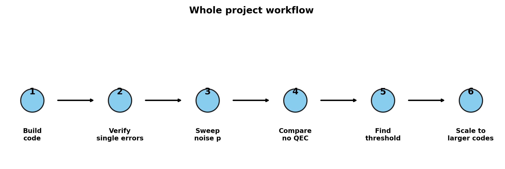

# Presentation: Perfect [[5,1,3]] Quantum Error Correction

## Slide 1: Title

Perfect `[[5,1,3]]` Quantum Error Correction

Goal: protect one logical qubit using five physical qubits, then test when error correction helps.

---

## Slide 2: Why Do We Need QEC?

Quantum computers are fragile.

- A qubit can suffer a bit flip: `|0>` becomes `|1>`.
- A qubit can suffer a phase flip: `|+>` becomes `|->`.
- Real devices also have measurement errors, gate errors, decoherence, and crosstalk.

Without QEC, a long computation eventually loses the quantum information.

---

## Slide 3: Why Not Just Copy The Qubit?

Classical error correction copies bits: `0 -> 000`.

Quantum states cannot be copied directly because of the no-cloning theorem. Instead, QEC spreads information across entanglement so that no single physical qubit contains the whole logical state.

---

## Slide 4: The Big Idea

We encode:

`|psi> = alpha|0> + beta|1>`

into:

`|psi_L> = alpha|0_L> + beta|1_L>`

The logical state is protected because single-qubit errors move the state into a detectable syndrome subspace.

---

## Slide 5: What Makes The Five-Qubit Code Special?

The Perfect `[[5,1,3]]` code:

- uses `n=5` physical qubits,
- stores `k=1` logical qubit,
- has distance `d=3`,
- corrects `t=(d-1)/2=1` arbitrary single-qubit error.

It is called compact because no smaller code can correct an arbitrary single-qubit quantum error.

---

## Slide 6: Stabilizers

The code is defined by four stabilizers:

| Stabilizer | Pauli string |
| --- | --- |
| `S1` | `XZZXI` |
| `S2` | `IXZZX` |
| `S3` | `XIXZZ` |
| `S4` | `ZXIXZ` |

Each single-qubit `X`, `Y`, or `Z` error produces a unique four-bit syndrome.

---

## Slide 7: Circuit View

The circuit flow is:

Logical state preparation -> encoded five-qubit state -> sample error -> syndrome extraction.

---

## Slide 8: Noiseless Proof

In the ideal simulator, every single-qubit Pauli error was tested:

- 5 qubits,
- 3 Pauli errors each,
- 15 total nontrivial single-qubit errors.

All recovered to fidelity `0.9999999999999998` or better.

---

## Slide 9: Expected Error Rates

Without QEC:

`p_no_QEC = 2p/3`

With an ideal one-round five-qubit code:

`p_uncorrectable = 1 - (1-p)^5 - 5p(1-p)^4`

At low `p`, QEC removes first-order single-error events, so the leading failures are two-error events.

---

## Slide 10: Random Noise Sweep

We sweep physical error rate:

`p = 0, 0.001, 0.005, 0.01, ..., 0.05`

For each value, we run 1000 shots and compute:

`logical_error = 1 - successful_output / total_shots`

---

## Slide 11: Threshold Demonstration

Below threshold: QEC helps.

Above threshold: the extra hardware and multi-error events dominate.

In this one-round model, the estimated crossing is:

`p ~= 0.13755`

---

## Slide 12: When Is This Code Useful?

Useful when:

- physical errors are low,
- qubits are expensive,
- the goal is to demonstrate arbitrary single-qubit QEC,
- a compact code is more important than a scalable layout.

Less useful when:

- many correction rounds are needed,
- hardware connectivity is limited,
- large-distance fault-tolerant scaling is the goal.

---

## Slide 13: Comparing Codes

The final shared plot needs four curves:

- Shor `[[9,1,3]]`
- Steane `[[7,1,3]]`
- Perfect `[[5,1,3]]`
- Bacon-Shor `[[9,1,3]]`

This plot is ready. It will use teammate CSVs when available; until then, non-Perfect curves are labelled proxy curves.

---

## Slide 14: Scaling Beyond One Error

Distance controls error-correction power:

`d = 2t + 1`

The Perfect code has `d=3`, so `t=1`.

To correct more errors, we need larger-distance codes.

---

## Slide 15: Whole Project Workflow

Build -> verify -> sweep noise -> compare -> find threshold -> scale up.

---

## Slide 16: Future Outcomes

Next steps:

- integrate live `NoiseModel.from_backend()` data from Member 1's arena,
- replace proxy comparison curves with teammate data,
- submit hardware jobs after IBM Runtime credentials are configured,
- repeat syndrome extraction over multiple rounds,
- study larger-distance surface-code models.

---

## Slide 17: Main Takeaway

The Perfect `[[5,1,3]]` code is the smallest full arbitrary single-qubit QEC code.

It proves the central idea:

single physical errors can be detected and corrected without measuring the logical quantum state itself.

