# Perfect [[5,1,3]] Quantum Error Correction Report

This report covers the Member 3 task from `idea.md`: implement the compact five-qubit code, demonstrate noiseless single-error recovery, study random and backend-like noise, and connect the data-visualization part to the scaling discussion. The five-qubit code is a stabilizer code rather than a subsystem code; the subsystem-code role in the charter belongs to Bacon-Shor, but the five-qubit implementation here is compatible with the shared QEC arena.

## Code Definition

The perfect code encodes one logical qubit into five physical qubits and has parameters `[[5,1,3]]`. The distance is `d=3`, so it corrects

`t = floor((d-1)/2) = 1`

arbitrary single-qubit error. The simulation derives the logical codewords directly from these stabilizer generators:

| Generator | Pauli string |
| --- | --- |
| `S1` | `XZZXI` |
| `S2` | `IXZZX` |
| `S3` | `XIXZZ` |
| `S4` | `ZXIXZ` |

The logical operators used are `X_L = XXXXX` and `Z_L = ZZZZZ`. The input state for the run was

`|psi> = alpha|0> + beta|1>`, with `alpha = 0.849109` and `beta = 0.393262 + 0.352646i`.

The logical codeword support derived from the stabilizers is shown below:


The code structure is compact: one logical qubit is distributed across only five physical qubits, and the four stabilizers create the syndrome space needed to identify single-qubit Pauli errors.

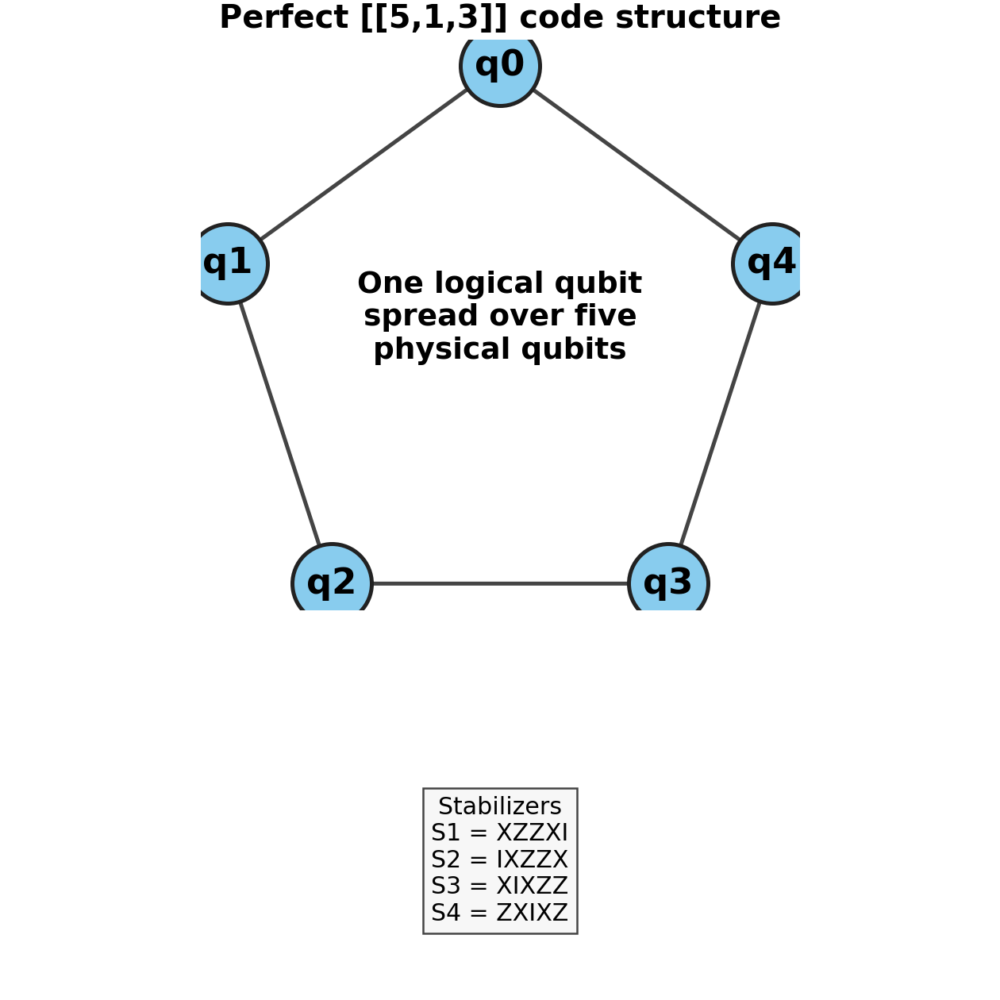

The complete project flow is:

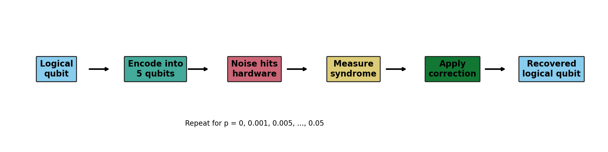

## Circuit Pictures

The encoded-state preparation is represented by Qiskit's `initialize` instruction. This is compact for diagrams and exact statevector simulation; on real hardware it will be transpiled into native gates and can become deep.


The syndrome extraction circuit measures the four stabilizers with four ancilla qubits. For an `X` in a stabilizer, the data qubit is basis-rotated with `H`, entangled into the syndrome ancilla, and rotated back.


The full static demo circuit initializes the logical state, injects a sample `X` error on data qubit 2, and then extracts the syndrome. The actual correction is applied in the simulator/post-processing layer through the lookup table, since static hardware circuits cannot classically branch into all corrections without dynamic-circuit support.


## Noiseless Error-Free Simulation

The noiseless simulation sweeps every single-qubit Pauli error: `X`, `Y`, and `Z` on each of the five physical qubits. Each of the 15 nontrivial errors has a unique four-bit syndrome and is corrected by applying the same Pauli on the same qubit.


The key check is:

| Quantity | Result |
| --- | --- |
| Number of nontrivial single-qubit Pauli errors checked | 15 |
| Maximum fidelity before recovery | `9.06e-33` |
| Minimum fidelity after recovery | `0.9999999999999998` |


This is the expected behavior for a distance-3 perfect code: a single physical Pauli error moves the encoded state into a syndrome subspace orthogonal to the original code space, and syndrome recovery maps it back.

## Random Noise

For random-noise experiments, each data qubit independently receives a Pauli error with probability `p`; conditioned on an error, `X`, `Y`, and `Z` are chosen uniformly. The Monte Carlo run used 3000 trials at each point.


Representative results:

| `p` | Logical failure rate | Mean recovered fidelity |
| --- | --- | --- |
| `0.002` | `0.0000` | `1.0000` |
| `0.010` | `0.0017` | `0.9989` |
| `0.050` | `0.0197` | `0.9870` |
| `0.100` | `0.0777` | `0.9488` |
| `0.150` | `0.1660` | `0.8886` |

The failures appear mainly when two or more physical qubits are hit in the same correction round. That matches the `d=3` limit: the code corrects one arbitrary error but is not guaranteed to correct two.

## Theoretical Expected Error Rates

For a bare unencoded qubit under uniform Pauli noise, the expected state infidelity is

`p_no_QEC = 2p/3`

because one of the three Pauli errors is sampled after a physical error event, and the pure-state depolarizing fidelity becomes `1 - 2p/3`.

For an ideal one-round `[[5,1,3]]` correction step, the simple block-level theory is:

`p_uncorrectable = 1 - (1-p)^5 - 5p(1-p)^4`

This is the probability that two or more of the five data qubits are hit in the same correction round. The exact statevector/density-matrix recovery is slightly more informative than this event-counting formula, because some multi-error events can overlap with logical/stabilizer structure in state-dependent ways.

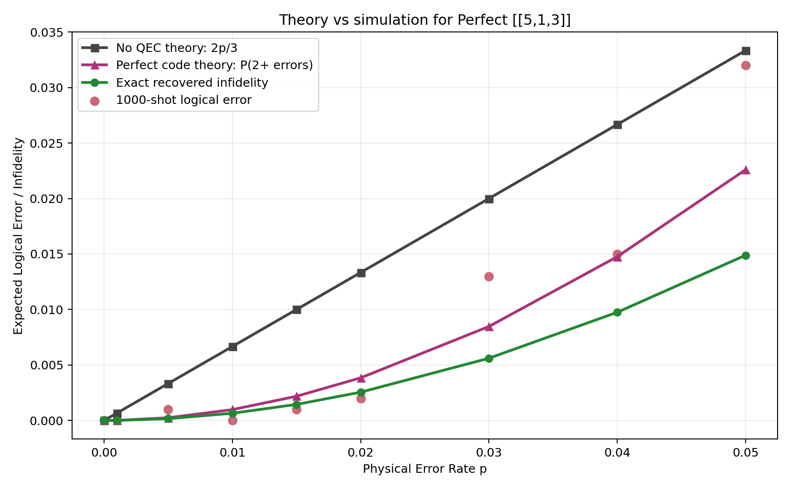

Key values from `data/theory_expected_error_rates.csv`:

| `p` | No-QEC theory | Perfect-code event theory | Exact recovered infidelity | 1000-shot logical error |
| --- | --- | --- | --- | --- |
| `0.001` | `0.000667` | `0.00000998` | `0.00000665` | `0.000` |
| `0.010` | `0.006667` | `0.000980` | `0.000652` | `0.000` |
| `0.020` | `0.013333` | `0.003842` | `0.002550` | `0.002` |
| `0.050` | `0.033333` | `0.022593` | `0.014888` | `0.032` |

The main insight is that the five-qubit code changes the leading scaling from approximately linear in `p` to approximately quadratic in `p` for small physical error rates. In plain language: single errors are removed, so failures mostly start when two or more errors occur.

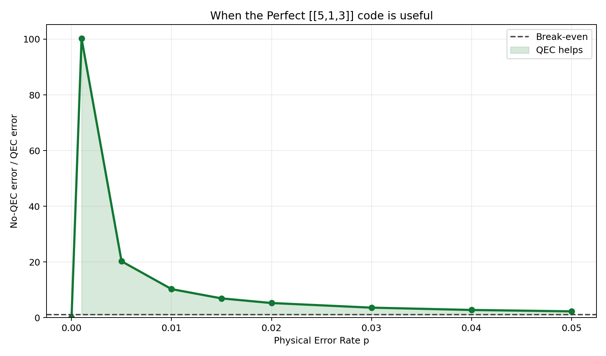

## When The Perfect Code Is Useful

The `[[5,1,3]]` code is useful when the physical error rate is low enough that two-error events are rare, and when qubit count is expensive. Its main strengths are:

- It is the smallest possible code that corrects an arbitrary single-qubit error.
- It is ideal for demonstrating the stabilizer idea because the syndrome table has exactly 16 entries: one no-error syndrome plus 15 single-qubit Pauli errors.
- It gives a clear threshold-style curve where QEC helps at low `p` and eventually hurts when overhead/noise dominates.

Its main weaknesses are:

- The encoding and syndrome structure are dense, so hardware depth can be high after transpilation.
- It corrects only one physical error per block per round.
- It is not the most practical large-scale architecture; surface-code-style layouts scale better because they use local checks on a 2D grid.

For this project, it is valuable because it is compact enough to simulate and visualize fully, while still showing the essential QEC mechanism.

## Simulated Backend-Like Noise

The local environment does not currently include `qiskit_ibm_runtime`, so a real IBM backend calibration profile could not be fetched in this run. To keep the report moving, the project includes a nonuniform backend-like depolarizing profile over the five data qubits and scales it upward to show behavior under increasingly strong hardware-like noise.


The script `submit_hardware_jobs.py` is included as the account-dependent next step. It uses IBM Runtime's `QiskitRuntimeService` and `SamplerV2` pattern, and should be run only after credentials and `qiskit_ibm_runtime` are installed. IBM's current Runtime docs describe `QiskitRuntimeService.backend()`, `backends()`, `least_busy()`, and primitive jobs such as Sampler/Estimator jobs: https://quantum.cloud.ibm.com/docs/api/qiskit-ibm-runtime/0.16/runtime-service

## Threshold-Style Plot

The threshold plot compares one noisy bare physical qubit against the recovered encoded block under an independent depolarizing model. In this simplified one-round model, the estimated crossing is:

`p ~= 0.13755`


The required Member-3 output plot is also saved at `threshold_plot.png`:

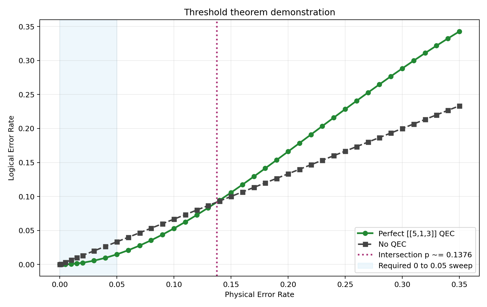

Below this crossing, the QEC block suppresses the logical infidelity relative to an unencoded qubit. Above it, multiple-error events become common enough that the overhead no longer helps. This is a threshold-style visualization for the report, not a full fault-tolerant threshold theorem proof, because it does not include repeated rounds, measurement faults, correlated hardware errors, leakage, or a decoder over a large code family.

## Shared-Arena Output

The required 1000-shot sweep from `p=0` to `p=0.05` is stored in `data/member3_perfect.csv` and duplicated as `results.csv` for the requested handoff format. The main Member-3 curve is:

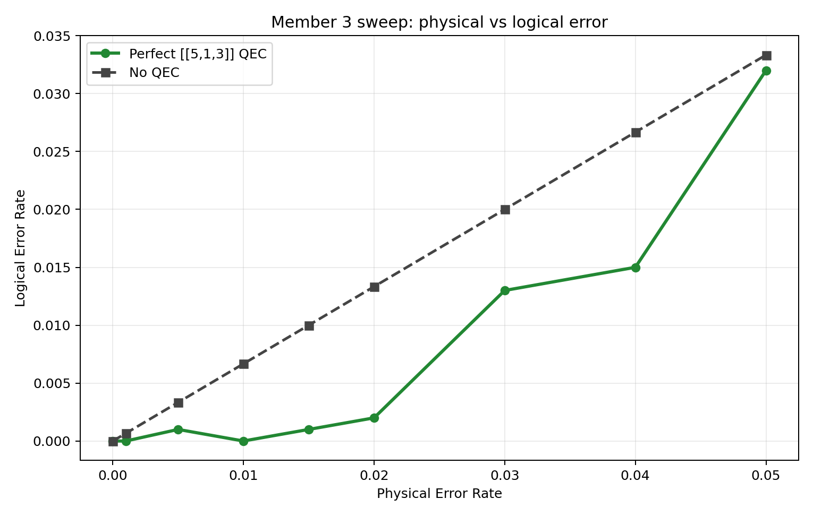

The four-code comparison plot is generated by `plot_results.py`. It will automatically use teammate CSVs named `data/member1_shor.csv`, `data/member2_steane.csv`, and `data/member4_bacon_shor.csv` if they are present. In this local run those files were not available, so Shor, Steane, and Bacon-Shor are clearly labelled proxy curves until team data arrives.

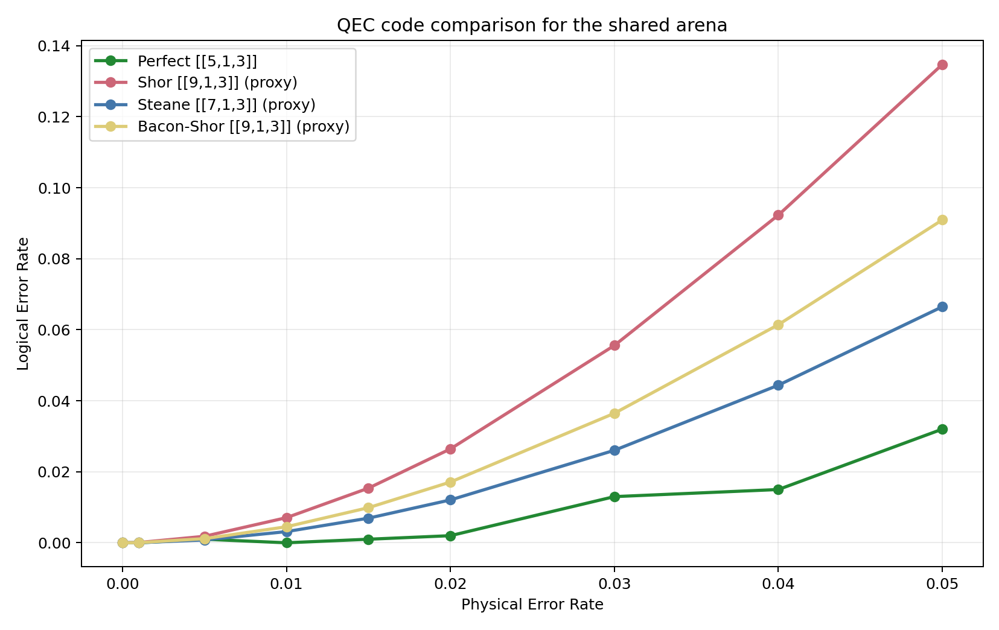

Additional proof-of-code graphs:

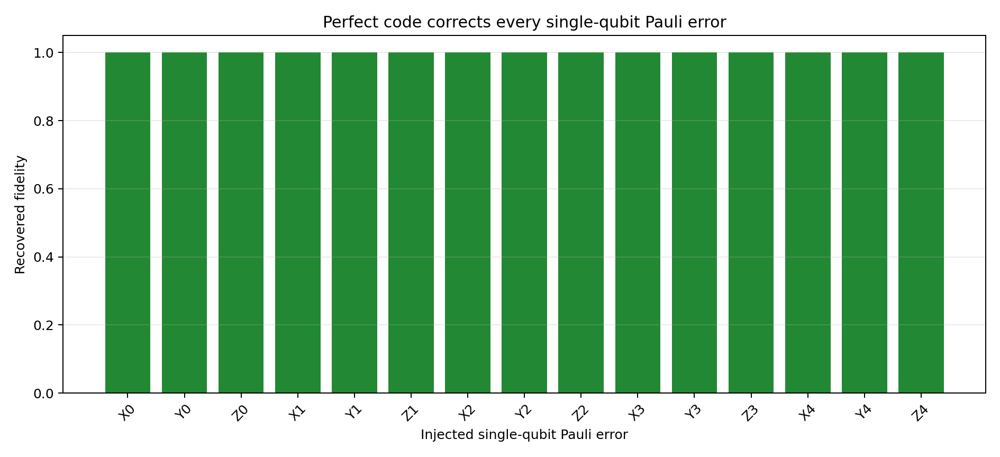

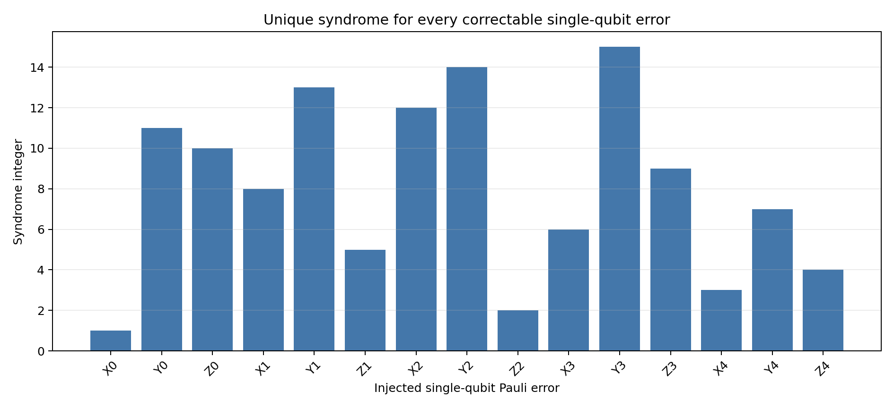

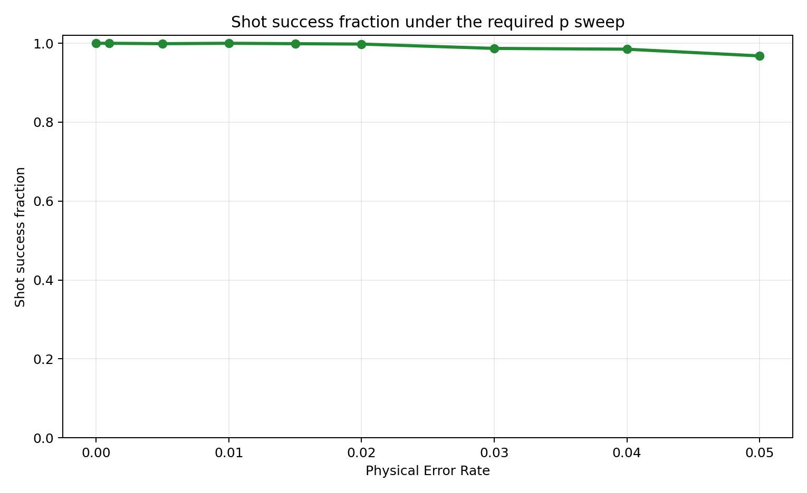

## Scaling of Quantum Error Correction

The `[[n,k,d]]` notation means:

| Symbol | Meaning |
| --- | --- |
| `n` | physical qubits used by one encoded block |
| `k` | logical qubits protected by the block |
| `d` | code distance, the minimum weight of an undetectable logical error |

For arbitrary error correction, `d = 2t + 1`, so a `d=3` code corrects `t=1` error. The five-qubit, Steane, Shor, and Bacon-Shor codes in the charter are all distance-3 examples in the baseline comparison.


To scale beyond `t=1`, quantum computers need larger-distance codes. The five-qubit code is excellent for the first demonstration because it is optimal in `n`, but it is not a complete scaling roadmap. For larger machines, we care about three linked quantities:

- Higher `d` increases the number of correctable errors through `t=(d-1)/2`.
- Higher `d` costs more physical qubits and more syndrome measurements.
- Logical error only improves with distance when the physical error rate is below the relevant threshold.

The following educational scaling model uses a rough surface-code overhead `n ~ 2d^2` and a toy logical-error law to show the tradeoff. This is not a calibrated decoder result; it is a visualization of the scaling idea.

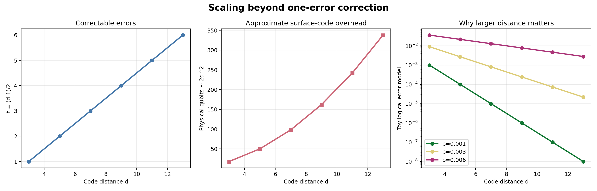

Two standard paths are:

- Concatenation: encode each physical qubit of one code into another layer of code blocks. This increases distance recursively but rapidly increases overhead.
- Topological surface codes: arrange qubits on a 2D lattice and use local stabilizer measurements. Increasing the lattice distance improves logical protection and is the dominant roadmap idea for large-scale fault tolerance.

The practical future outcome is therefore not "use one five-qubit block forever." It is: use the five-qubit code to understand the principle, then scale to repeated syndrome extraction, better decoders, and larger-distance topological codes when the hardware supports enough qubits and low enough physical error.

## Reproducibility

Beginner-friendly presentation files:

- `presentation.md`
- `presentation.html`

Open `presentation.html` directly in a browser for a slide-style walkthrough from basics to results and future scaling.

Run the full local suite from the repository root:

```bash
qiskit_env/bin/python CCDS_QMQC_Project/Group_Project/qec_5qubit_project.py
```

Run the exact Member-3 workflow deliverables:

```bash
qiskit_env/bin/python CCDS_QMQC_Project/Group_Project/runner.py
```

Regenerate only the requested plots:

```bash
qiskit_env/bin/python CCDS_QMQC_Project/Group_Project/plot_results.py
```

Generate the extra theory/scaling/presentation-support figures:

```bash
qiskit_env/bin/python CCDS_QMQC_Project/Group_Project/educational_analysis.py
```

For progress details:

```bash
qiskit_env/bin/python CCDS_QMQC_Project/Group_Project/qec_5qubit_project.py --verbose
```

The generated data tables are in `data/`, and the figures linked in this report are in `figures/`.
