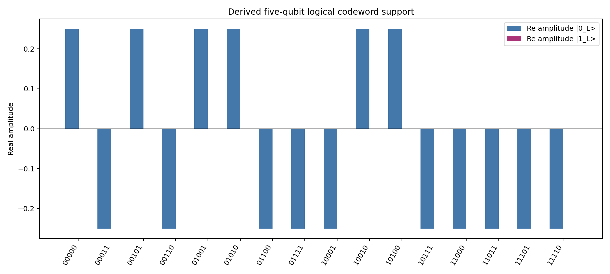
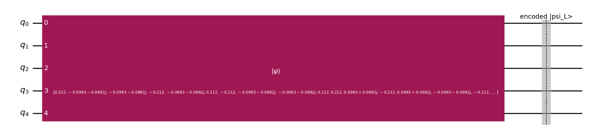
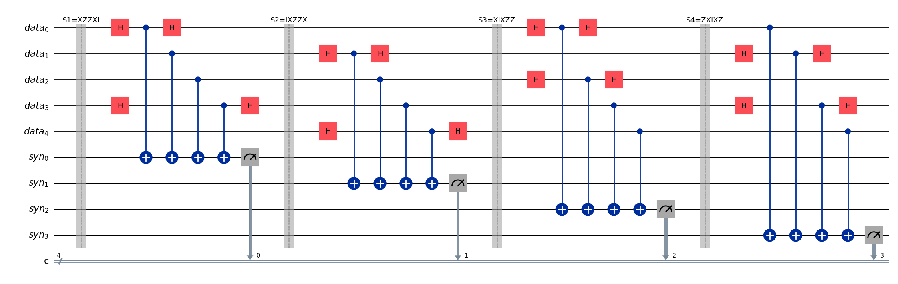
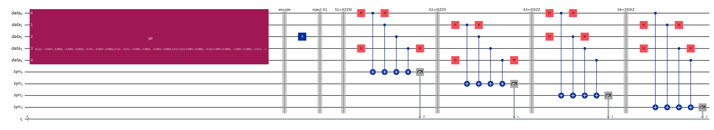
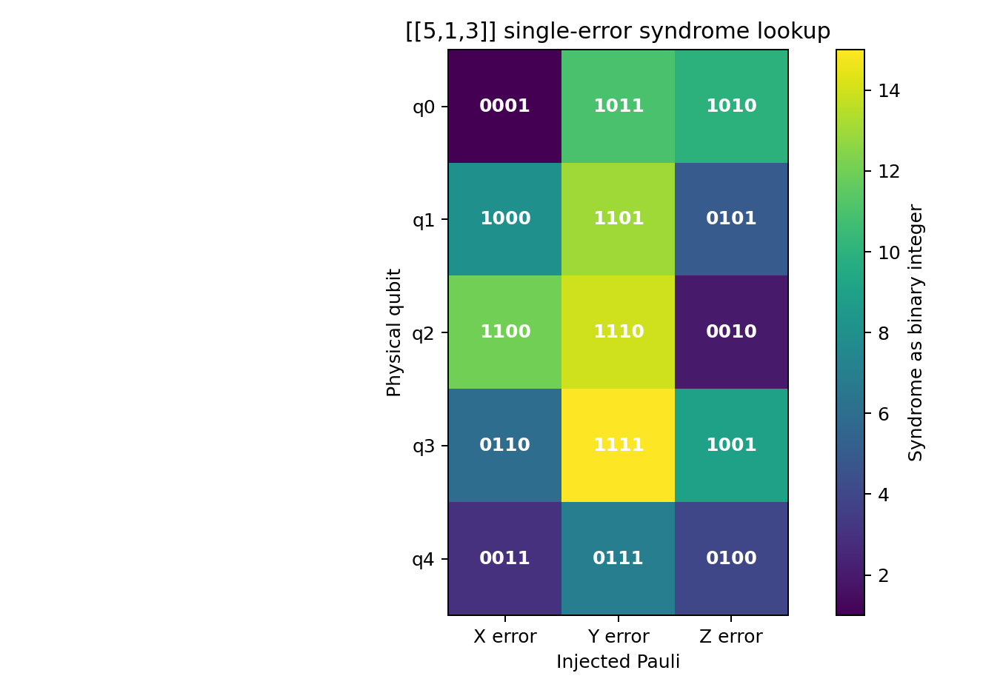
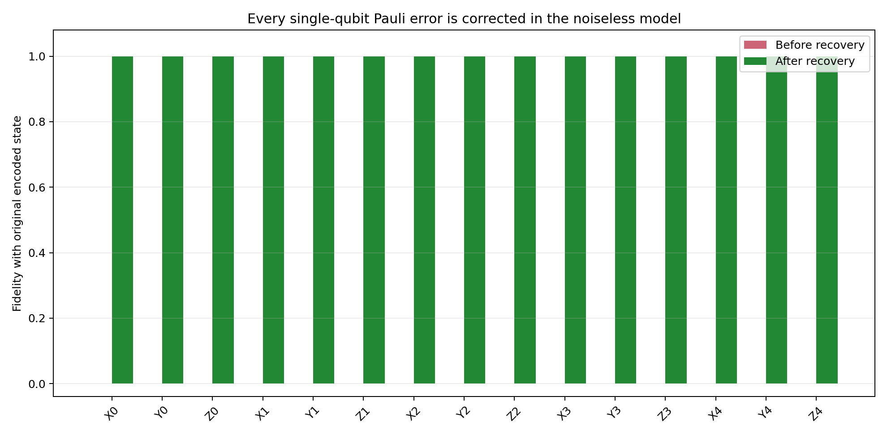
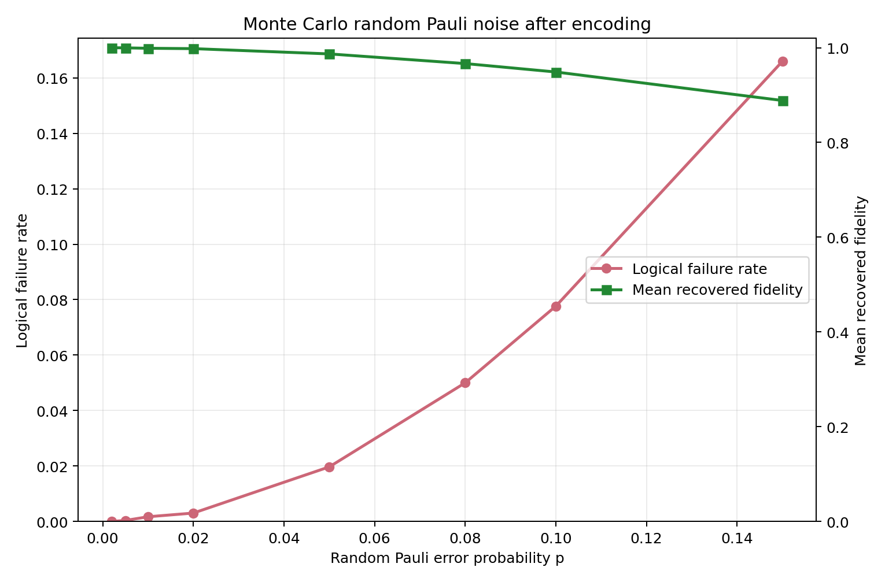
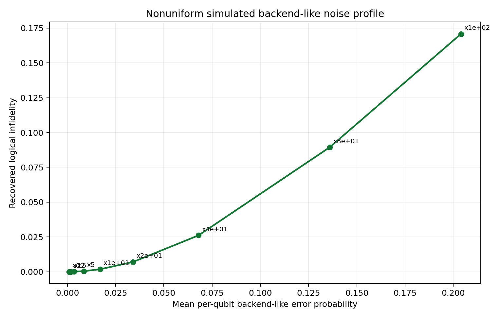
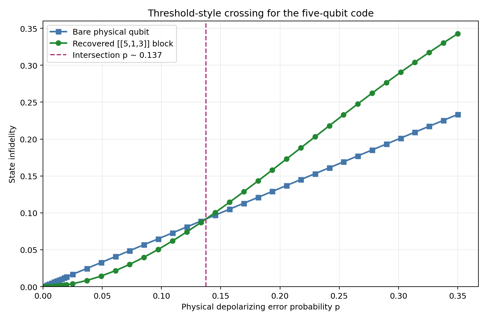
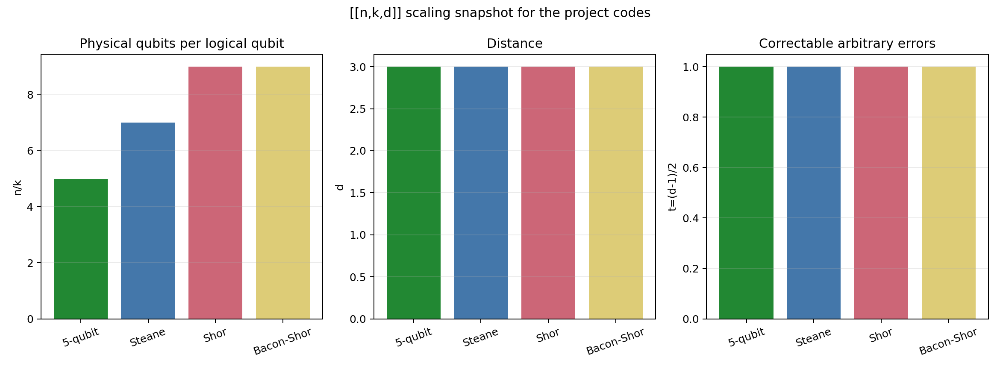

# Perfect [[5,1,3]] Quantum Error Correction Report

This report covers the Member 3 task from `idea.md`: implement the compact five-qubit code, demonstrate noiseless single-error recovery, study random and backend-like noise, and connect the data-visualization part to the scaling discussion. The five-qubit code is a stabilizer code rather than a subsystem code; the subsystem-code role in the charter belongs to Bacon-Shor, but the five-qubit implementation here is compatible with the shared QEC arena.

## Code Definition

The perfect code encodes one logical qubit into five physical qubits and has parameters `[[5,1,3]]`. The distance is `d=3`, so it corrects

`t = floor((d-1)/2) = 1`

arbitrary single-qubit error. The simulation derives the logical codewords directly from these stabilizer generators:

| Generator | Pauli string |
| --- | --- |
| `S1` | `XZZXI` |
| `S2` | `IXZZX` |
| `S3` | `XIXZZ` |
| `S4` | `ZXIXZ` |

The logical operators used are `X_L = XXXXX` and `Z_L = ZZZZZ`. The input state for the run was

`|psi> = alpha|0> + beta|1>`, with `alpha = 0.849109` and `beta = 0.393262 + 0.352646i`.

The logical codeword support derived from the stabilizers is shown below:



## Circuit Pictures

The encoded-state preparation is represented by Qiskit's `initialize` instruction. This is compact for diagrams and exact statevector simulation; on real hardware it will be transpiled into native gates and can become deep.



The syndrome extraction circuit measures the four stabilizers with four ancilla qubits. For an `X` in a stabilizer, the data qubit is basis-rotated with `H`, entangled into the syndrome ancilla, and rotated back.



The full static demo circuit initializes the logical state, injects a sample `X` error on data qubit 2, and then extracts the syndrome. The actual correction is applied in the simulator/post-processing layer through the lookup table, since static hardware circuits cannot classically branch into all corrections without dynamic-circuit support.



## Noiseless Error-Free Simulation

The noiseless simulation sweeps every single-qubit Pauli error: `X`, `Y`, and `Z` on each of the five physical qubits. Each of the 15 nontrivial errors has a unique four-bit syndrome and is corrected by applying the same Pauli on the same qubit.



The key check is:

| Quantity | Result |
| --- | --- |
| Number of nontrivial single-qubit Pauli errors checked | 15 |
| Maximum fidelity before recovery | `9.06e-33` |
| Minimum fidelity after recovery | `0.9999999999999998` |



This is the expected behavior for a distance-3 perfect code: a single physical Pauli error moves the encoded state into a syndrome subspace orthogonal to the original code space, and syndrome recovery maps it back.

## Random Noise

For random-noise experiments, each data qubit independently receives a Pauli error with probability `p`; conditioned on an error, `X`, `Y`, and `Z` are chosen uniformly. The Monte Carlo run used 3000 trials at each point.



Representative results:

| `p` | Logical failure rate | Mean recovered fidelity |
| --- | --- | --- |
| `0.002` | `0.0000` | `1.0000` |
| `0.010` | `0.0017` | `0.9989` |
| `0.050` | `0.0197` | `0.9870` |
| `0.100` | `0.0777` | `0.9488` |
| `0.150` | `0.1660` | `0.8886` |

The failures appear mainly when two or more physical qubits are hit in the same correction round. That matches the `d=3` limit: the code corrects one arbitrary error but is not guaranteed to correct two.

## Simulated Backend-Like Noise

The local environment does not currently include `qiskit_ibm_runtime`, so a real IBM backend calibration profile could not be fetched in this run. To keep the report moving, the project includes a nonuniform backend-like depolarizing profile over the five data qubits and scales it upward to show behavior under increasingly strong hardware-like noise.



The script `submit_hardware_jobs.py` is included as the account-dependent next step. It uses IBM Runtime's `QiskitRuntimeService` and `SamplerV2` pattern, and should be run only after credentials and `qiskit_ibm_runtime` are installed. IBM's current Runtime docs describe `QiskitRuntimeService.backend()`, `backends()`, `least_busy()`, and primitive jobs such as Sampler/Estimator jobs: https://quantum.cloud.ibm.com/docs/api/qiskit-ibm-runtime/0.16/runtime-service

## Threshold-Style Plot

The threshold plot compares one noisy bare physical qubit against the recovered encoded block under an independent depolarizing model. In this simplified one-round model, the estimated crossing is:

`p ~= 0.1375`



Below this crossing, the QEC block suppresses the logical infidelity relative to an unencoded qubit. Above it, multiple-error events become common enough that the overhead no longer helps. This is a threshold-style visualization for the report, not a full fault-tolerant threshold theorem proof, because it does not include repeated rounds, measurement faults, correlated hardware errors, leakage, or a decoder over a large code family.

## Scaling of Quantum Error Correction

The `[[n,k,d]]` notation means:

| Symbol | Meaning |
| --- | --- |
| `n` | physical qubits used by one encoded block |
| `k` | logical qubits protected by the block |
| `d` | code distance, the minimum weight of an undetectable logical error |

For arbitrary error correction, `d = 2t + 1`, so a `d=3` code corrects `t=1` error. The five-qubit, Steane, Shor, and Bacon-Shor codes in the charter are all distance-3 examples in the baseline comparison.



To scale beyond `t=1`, quantum computers need larger-distance codes. Two standard paths are:

- Concatenation: encode each physical qubit of one code into another layer of code blocks. This increases distance recursively but rapidly increases overhead.
- Topological surface codes: arrange qubits on a 2D lattice and use local stabilizer measurements. Increasing the lattice distance improves logical protection and is the dominant roadmap idea for large-scale fault tolerance.

## Reproducibility

Run the full local suite from the repository root:

```bash
qiskit_env/bin/python CCDS_QMQC_Project/Group_Project/qec_5qubit_project.py
```

For progress details:

```bash
qiskit_env/bin/python CCDS_QMQC_Project/Group_Project/qec_5qubit_project.py --verbose
```

The generated data tables are in `data/`, and the figures linked in this report are in `figures/`.

